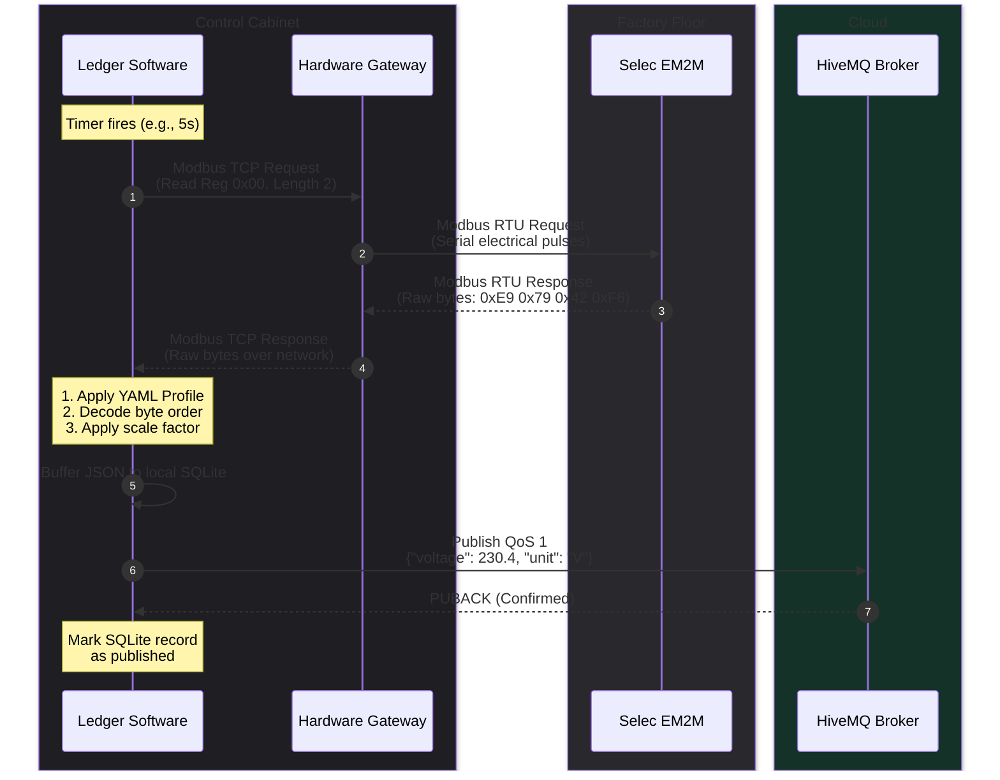

# Hardware & System Architecture

This document outlines the physical wiring and logical data flow of the Modbus-to-Cloud architecture. It defines the strict boundary between the **purchased hardware components** (field devices and gateways) and the **custom software layer** (this project).

## 1. Physical Wiring Architecture

Industrial devices like the Selec EM2M use RS485 for communication. RS485 is a robust, differential serial standard that allows multiple devices to be daisy-chained on a single 2-wire bus. 

Because modern servers and cloud infrastructure cannot directly read RS485 electrical signals, a rail-mounted Serial-to-Ethernet/WiFi gateway is used as a bridge.

```mermaid
flowchart LR
    subgraph Field ["Field Devices (RS485 Bus)"]
        direction LR
        Dev1["Selec EM2M\nEnergy Meter\n(Slave ID: 1)"]
        Dev2["Advantech ADAM-4017+\nAnalog I/O (Process)\n(Slave ID: 2)"]
        
        Dev2 <== "RS485 (A/B wires)" ===> Dev1
    end

    subgraph Cabinet ["Control Cabinet"]
        direction LR
        GW["Serial Server Gateway\n(e.g., USR-DR404, W610)\nConverts RS485 ↔ TCP/IP"]
        Edge["Edge Compute\n(Raspberry Pi / IPC)\nRunning 'Ledger' Software"]
        
        Dev1 <== "RS485 (A/B)" ===> GW
        GW <== "Ethernet/WiFi" ===> Edge
    end

    subgraph Cloud ["Cloud / Operations"]
        Broker["MQTT Broker"]
        Dash["Ledger Web Dashboard"]
        
        Edge == "Internet\n(MQTT over TCP)" ===> Broker
        Broker == "WebSockets" ===> Dash
    end

    classDef hardware fill:#2a2a30,stroke:#e2e2de,stroke-width:1px,color:#e8e8ec;
    classDef software fill:#1f7060,stroke:#e2e2de,stroke-width:1px,color:#ffffff;
    classDef cloud fill:#9a7810,stroke:#e2e2de,stroke-width:1px,color:#ffffff;

    class Dev1,Dev2,GW hardware;
    class Edge software;
    class Broker,Dash cloud;
```

### Hardware Components
1. **Field Devices (e.g., Selec EM2M)**: Legacy or modern industrial sensors that speak Modbus RTU over a 2-wire RS485 connection.
2. **Serial Server Gateway**: A cheap, reliable DIN-rail module. Its *only* job is electrical and protocol conversion. When it receives a TCP packet from the network, it converts it to an RTU serial pulse on the RS485 wires, and vice versa.
3. **Edge Compute**: A local PC, Raspberry Pi, or industrial controller running this Python software layer. It must be on the same local network (LAN/WIFI) as the gateway.

---

## 2. Protocol Translation (Logical Flow)

The physical wiring handles the electricity; the protocol handles the language. 

Many gateways advertise built-in "MQTT Modbus Gateway" features. **We explicitly do not use them.** Built-in gateway MQTT is usually rigid, loses data during outages, and outputs raw registers instead of named variables. Instead, we use the gateway strictly as a transparent Modbus TCP Server.

### Why this architecture wins for clients:
* **Hardware Independence**: If the gateway dies, you can replace it with any other brand of serial server for $30. The software doesn't care, as long as it speaks Modbus TCP.
* **Network Tolerance**: By buffering on the Edge Compute (Step 6), a severed internet connection to the cloud doesn't stop the Modbus polling (Steps 2-5). The data is safely queued locally until the internet returns.
* **Bandwidth Efficiency**: Instead of streaming continuous raw hex data to the cloud to be processed centrally, the Edge software processes it locally and only transmits highly compressed, normalized JSON.
